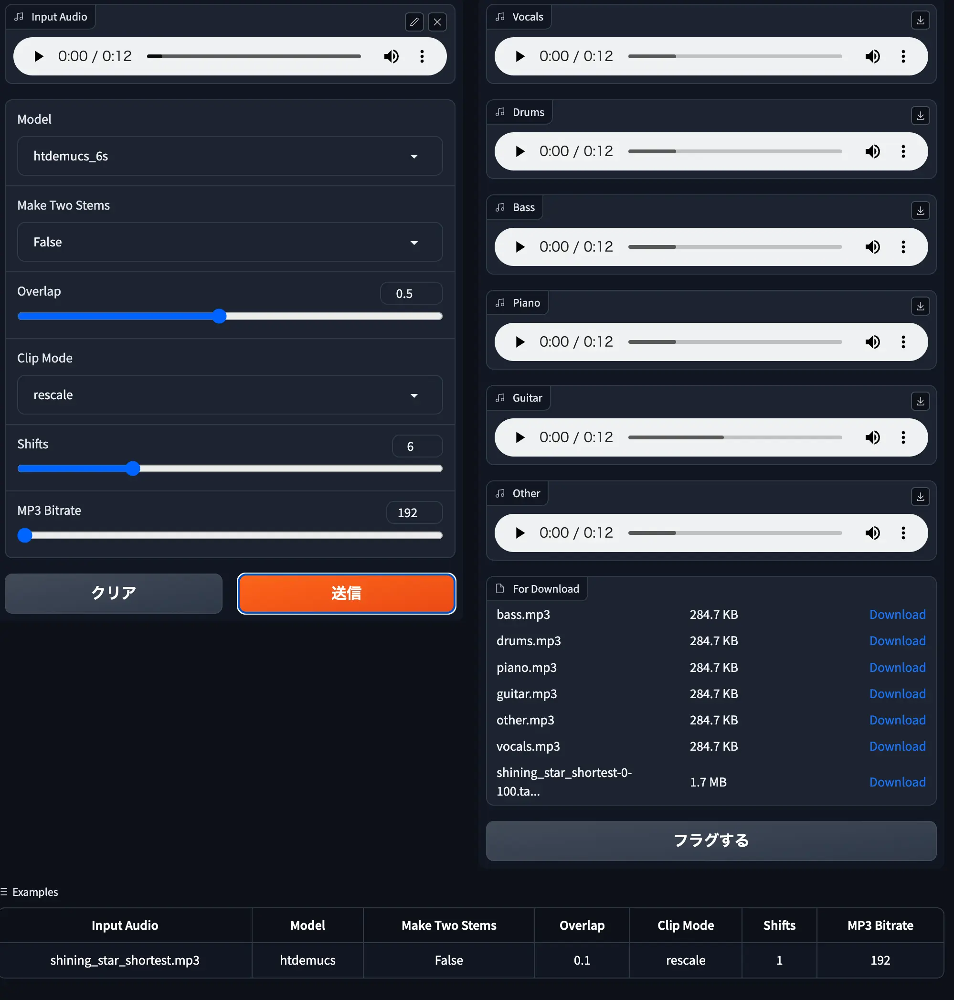

## これはなに？
demucsという音源分離モデルをWebUI上で動かせるようにしたものです。




## 起動方法

dockerの場合
```
sudo docker compose up
```


poetryの場合
```
poetry run gradio src/app.py
```

そうしたら ブラウザからlocalhost:8080 にアクセスすればOK。


## ディレクトリ構造

```
    ├── .github/            <- Settings for GitHub.
    │
    ├── data/               <- Datasets.
    │
    ├── models/             <- Pretrained and serialized models.
    │
    ├── notebooks/          <- Jupyter notebooks.
    │
    ├── outputs/            <- Outputs.
    │
    ├── src/                <- Source code. This sould be Python module.
    │
    ├── tests/              <- Test codes.
    │
    ├── .flake8             <- Setting file for Flake8.
    ├── .dockerignore
    ├── .gitignore
    ├── LICENSE
    ├── Makefile            <- Makefile used as task runner.
    ├── poetry.lock         <- Lock file. DON'T edit this file manually.
    ├── poetry.toml         <- Setting file for Poetry.
    ├── pyproject.toml      <- Setting file for Project. (Poetry, Black, isort, Mypy)
    ├── Dockerfile          <- Dockerfile for this project.
    ├── docker-compose.yaml <- Docker Compose file for this project.
    └── README.md           <- The top-level README for developers.
  
  ```


## 環境構築
プロジェクトは[Ascender](https://github.com/cvpaperchallenge/Ascender)をもとにしてます.

上記のREADMEより、環境構築に必要な部分だけ抽出します。

### Dockerを用いる場合


以下三点のインストールが必要です。
- [Docker](https://www.docker.com/)
- [Docker Compose](https://github.com/docker/compose)
- [NVIDIA Container Toolkit (nvidia-docker2)](https://github.com/NVIDIA/nvidia-docker)


Docker と Docker Compose の install は下記のコードをbashで実行してください。
```bash
# Set up the repository
sudo apt update
sudo apt install ca-certificates curl gnupg lsb-release
sudo mkdir -p /etc/apt/keyrings
curl -fsSL https://download.docker.com/linux/ubuntu/gpg | sudo gpg --dearmor -o /etc/apt/keyrings/docker.gpg
echo \
"deb [arch=$(dpkg --print-architecture) signed-by=/etc/apt/keyrings/docker.gpg] https://download.docker.com/linux/ubuntu \
$(lsb_release -cs) stable" | sudo tee /etc/apt/sources.list.d/docker.list > /dev/null

Install Docker and Docker Compose
sudo apt update
sudo apt install docker-ce docker-ce-cli containerd.io docker-compose-plugin
```

nvidia-docker2 の install は下記のコードをbashで実行してください。
```bash
distribution=$(. /etc/os-release;echo $ID$VERSION_ID) \
    && curl -fsSL https://nvidia.github.io/libnvidia-container/gpgkey | sudo gpg --dearmor -o /usr/share/keyrings/nvidia-container-toolkit-keyring.gpg \
    && curl -s -L https://nvidia.github.io/libnvidia-container/$distribution/libnvidia-container.list | \
          sed 's#deb https://#deb [signed-by=/usr/share/keyrings/nvidia-container-toolkit-keyring.gpg] https://#g' | \
          sudo tee /etc/apt/sources.list.d/nvidia-container-toolkit.list

sudo apt update
sudo apt install -y nvidia-docker2
sudo systemctl restart docker
```


### Dockerを用いない場合 (Poetry)
Python3.10系がインストール済みであることが前提です。そうでないならば、[pyenv](https://github.com/pyenv/pyenv)等を用いて環境構築をしてください。

まずはPoetryをインストールします。
```bash
pip3 install poetry
```

次にこのREADME.mdがあるディレクトリで必要なライブラリをインストールします。
```bash
poetry install
```

